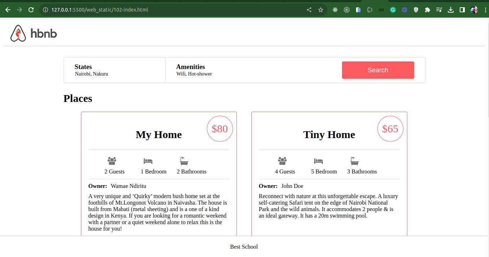

# Web Static

### Introducion

This is a https://airbnb.com static website clone. The deisgn is being implemented in bit that are defined as tasks. The static website will be further developed use the [AirBnB_clone Console](../console.py) to handle objects.

### On Big Screen Devices

### On Small Screen Devices

### Technologies

- HTML
- CSS

### Concepts used

- Frontend development
- Static website/web pages
- Responsive design
- Accessibility
- Perfomance
